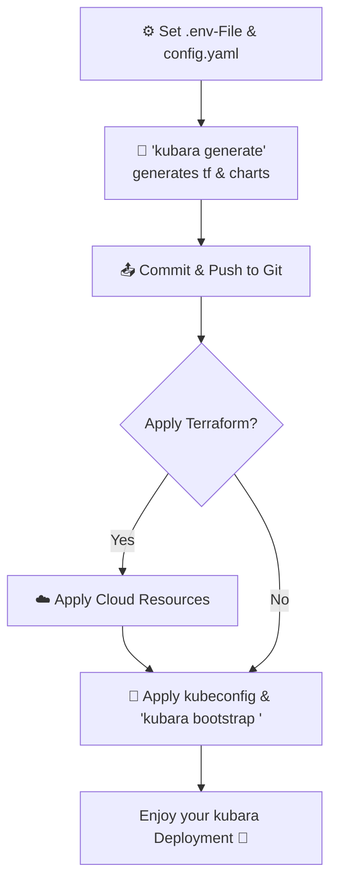

# Overview of Core Concepts

`kubara` is an opinionated, GitOps-first framework and bootstrap tool for building and operating a production-grade Kubernetes platform.

It is designed as a reusable platform foundation: kubara ships a default built-in catalog of platform components, generates reproducible Terraform and Helm artifacts, and expects ongoing operations to happen through Git instead of manual cluster changes.

  

## The main ideas behind kubara

### 1. GitOps is the operational model

kubara turns cluster and platform configuration into generated artifacts that are committed to Git and then reconciled by Argo CD.

That gives you:

- declarative desired state
- reviewable platform changes
- repeatable generation instead of hand-maintained manifests

### 2. kubara ships a default built-in catalog

kubara comes with a built-in catalog of services and templates for common platform capabilities such as ingress, certificates, policies, observability, storage, and authentication.

The **Components** section documents that default built-in catalog:

- [Components Overview](../3_components/components_overview.md)
- [Best Practices](../3_components/best_practices.md)

If you want to understand how catalogs work internally or create your own external catalog, see [Catalogs](catalogs.md).

### 3. Generated output is separated from cluster-specific customization

kubara keeps reusable generated artifacts separate from cluster-specific overlays so the platform stays maintainable across multiple clusters.

### 4. Bootstrap is only the beginning

`kubara bootstrap` installs Argo CD and required CRDs, but the long-term operating model is still GitOps: Argo CD manages itself and then rolls out the generated platform charts.

## Directory structure

kubara generates a specific directory structure in your Git repository to separate concerns:

- **`managed-service-catalog/`**
  This directory contains the reusable generated components such as Terraform modules and Helm charts. In normal usage, this is generated output, not hand-maintained source.

- **`customer-service-catalog/`**
  It contains cluster-specific overlays and values for the kubara setup.

The naming can be a little confusing at first:

- these directories are the **generated result**
- the **catalog concept** describes the input model kubara uses before generation

See [Catalogs](catalogs.md) for the detailed explanation.

## Conceptual flow

The diagram below shows the typical kubara workflow when following the [bootstrapping guide](bootstrapping.md):

1. Platform Engineer defines intent in `.env` and `config.yaml`.
2. Run `kubara generate` to render Terraform and Helm output.
3. Commit and push the generated result to Git.
4. Apply infrastructure where needed 
5. Bootstrap Argo CD using `kubara bootstrap <cluster-name>`
6. Let Argo CD continuously reconcile the generated platform state.

Secrets are typically synced via External Secrets based on your configured SecretStore or ClusterSecretStore.

## What kubara includes

- **Helm Charts**
  Predefined platform charts for core capabilities such as ingress,
  observability, identity, policy enforcement, and application delivery.

- **Architecture Models**
  Reference topologies for single-cluster, multi-cluster (hub & spoke),
  and hybrid-cloud setups.

- **Templates & Reusable Patterns**
  Reusable templates, GitOps folder structures, RBAC patterns,
  and security best practices.

- **Operational Playbooks**
  Step-by-step guidance for provisioning, upgrades, disaster recovery,
  secrets management, and policy enforcement.

- **Documentation & Decision Records**
  Usage documentation, technical guidance, and ADRs for architectural decisions.

- **Extension Guidelines**
  Conventions and interfaces for integrating custom workloads,
  controllers, and cluster add-ons in a maintainable way.

## Core Goals

- Enable rapid platform rollout
- Standardize architecture and governance
- Ensure security, compliance and observability
- Empower teams through self-service and GitOps

## Where to go next

- To understand catalog structure and create your own: [Catalogs](catalogs.md)
- To see the default built-in services kubara ships: [Components Overview](../3_components/components_overview.md)
- To continue the setup flow: [Bootstrapping](bootstrapping.md)
- To understand the platform topology: [Architecture overview](../4_architecture/architecture_overview.md)
