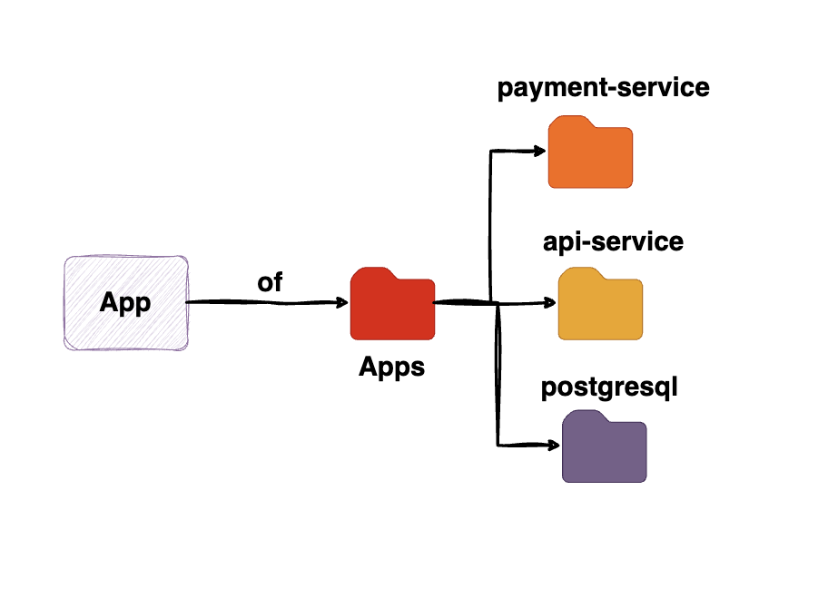
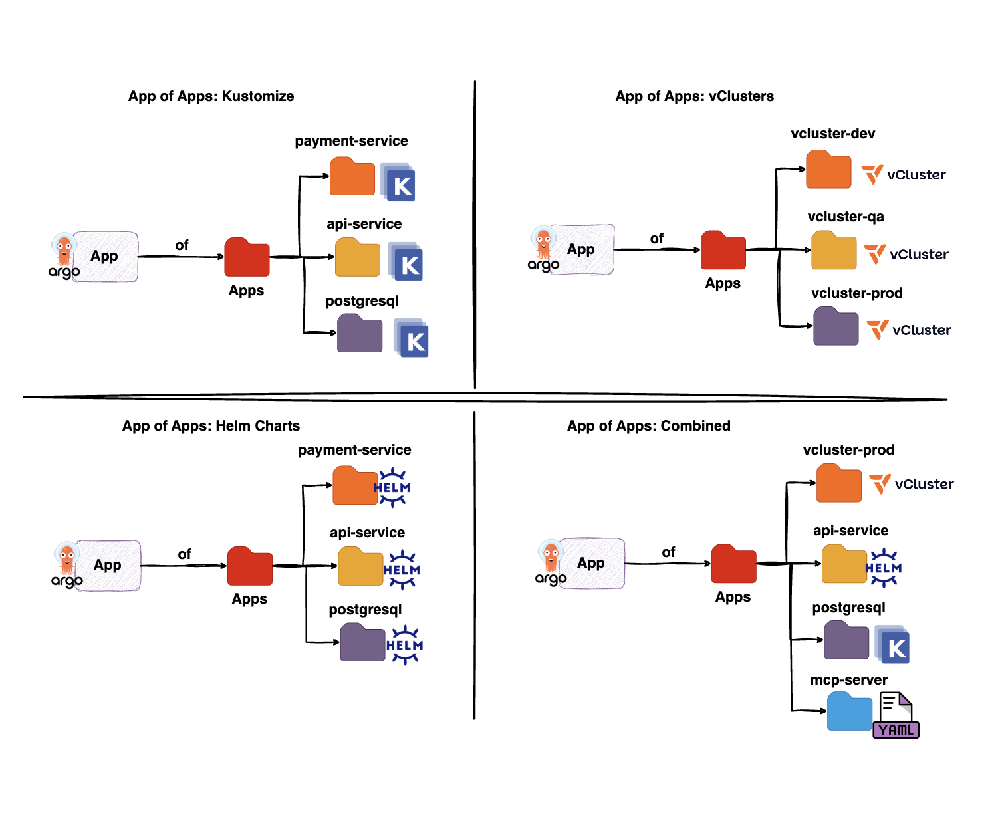

# Argo CD: Add App of Apps to kubara



The App of Apps pattern uses one parent Argo CD `Application` to manage a set
of child `Application` resources. In kubara, the parent points to a Git folder;
each manifest in that folder defines a separate child application.

## Minimal setup

Add a parent application to the Argo CD override of the hub cluster, for
example `platform-configs/<cluster>/helm/argo-cd/additional-values.yaml`:

```yaml
bootstrapValues:
  applications:
    - name: app-of-apps
      namespace: argocd
      projectName: <cluster-stage>
      destination:
        serverName: <cluster>
      repoUrl: https://github.com/example/<repository>
      repoPath: apps
      info:
        - name: type
          value: app-of-apps
```

The referenced repository then contains one Argo CD `Application` manifest per
child application:

```text
apps/
├── vcluster-dev.yaml
├── vcluster-test.yaml
├── frontend.yaml
├── api-service.yaml
└── postgresql.yaml
```

This setup is not recursive. With `repoPath: apps`, Argo CD reads only the
manifests directly in that directory. Child manifests placed in subfolders are
ignored without an error, keep them flat in `apps/`, or enable
`directory.recurse: true` on the parent application.

Ensure that the repository is allowed by the Argo CD project and that each
child `Application` uses a permitted destination. Commit and push the changes.

## When to use it

### 1. Create vClusters

Use one child `Application` per vCluster when every instance needs its own name,
namespace, domain, values, or lifecycle. Adding `apps/vcluster-test.yaml` makes
the parent application create and reconcile that vCluster application.

kubara's label-based `ApplicationSet` pattern deploys vClusters onto the hub
cluster and generates one vCluster application per matching cluster from a
shared template. Because a cluster carries a single value per label key, that
template produces one instance on the hub, so N vClusters would mean either N
`ApplicationSet`s with distinct labels or a different generator. App of Apps is
the simpler fit when the goal is **N independent vClusters on the same hub
cluster**: add one child `Application` manifest per vCluster to the folder, and
the labels stay out of it.

### 2. Manage different applications from one folder

Use a shared folder as a small application catalog. For example, separate child
manifests can deploy a frontend, an API, and a database from different charts
or repositories and into different namespaces. Adding or removing an
`Application` manifest changes what the parent manages.

## Supported application sources

Each child is an Argo CD `Application`, and its source can be a Helm chart, a
Kustomize overlay, or a directory containing plain YAML manifests. The parent
path itself may also use Helm or Kustomize.



## App of Apps versus ApplicationSet

Use an **ApplicationSet** to generate multiple similar applications from one
template, for example to roll out the same app to every cluster that carries
the matching label:

```yaml
cert-manager:
  status: enabled
```

Use **App of Apps** to group different applications that can have different
sources, values, destinations, and lifecycles under one parent application.
Both patterns can be used together.
