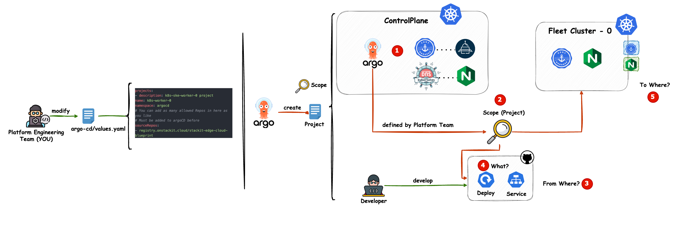

# Add Argo CD  Project

After you deployed your controlplane you will have an Argo CD set-up. It is the central application for your application
management and handles the Continuous Deployment of other applications (including Argo CD itself).

An Argo CD App Project is a logical concept to control:
`Who is allowed to do what and whereto.`
For more information check:
https://argo-cd.readthedocs.io/en/stable/user-guide/projects/

## **Modify argo-cd overlays**
Add the following to your `argo-cd/values.yaml`.
```yaml
projects:
  - description: k8s-ske-worker-0 project
    name: k8s-worker-0
    namespace: argocd
    # You can add as many allowed Repos in here as you like
    # Must be added to argoCD before
    sourceRepos:
      - registry.onstackit.cloud/stackit-edge-cloud-blueprint
```

That whats happening behind the scenes:



## **Push your changes to git**
Do not forget to push your changes to the git repository that is connected to your Argo CD instance.
If you let Argo CD manage itself, it will rollout the configured apps to your cluster

