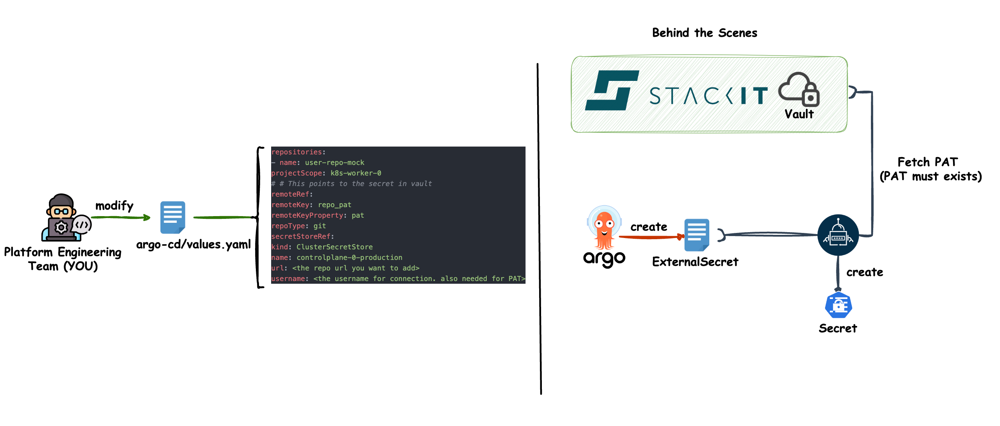

# Add Repository to Argo CD
To deploy applications with Argo CD we need to connect Repositories. This is also useful if you want to give developers
a way to deploy their applications onto your platform without much intervention on your side.

An Argo CD  App Repository is a logical concept to control where applications may be deployed from.
For more information check:
https://argo-cd.readthedocs.io/en/stable/user-guide/private-repositories/

## **Add credentials to vault**
Add the repository credentials to your vault. This can be a `password` or a `PAT`.
```json
{
  "repo_pat": {
    "pat": "<the kubeconfig>"
  }
}
```
## **Modify Argo CD overlays**
Add the following to your `argo-cd/values.yaml`.
```yaml
repositories:
    - name: user-repo-mock
      projectScope: k8s-worker-0
      # # This points to the secret in vault
      remoteRef:
        remoteKey: repo_pat
        remoteKeyProperty: pat
      repoType: git
      secretStoreRef:
        kind: ClusterSecretStore
        name: controlplane-0-production
      url: <the repo url you want to add>
      username: <the username for connection. also needed for PAT>
```

That whats happening behind the scenes:




## **Push your changes to git**
Do not forget to push your changes to the git repository that serves your Argo CD application.
If you let Argo CD manage itself, it will add the configured repository to your cluster.
