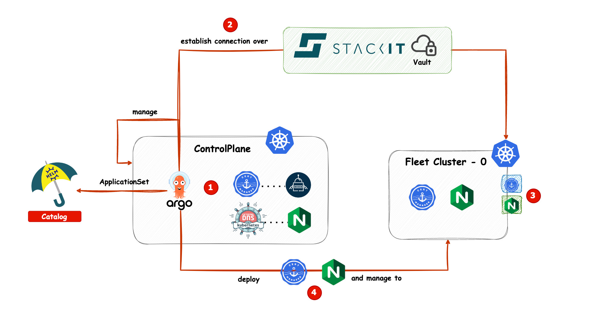

# Add Worker Cluster

After you have deployed your controlplane, you can add additional Kubernetes worker clusters and manage them through Argo CD.
The process is similar to the bootstrap process of your controlplane.

There are two ways to add a worker cluster.
If your worker cluster already exists, you need to follow different steps than when creating a new worker cluster using Terraform with Kubara.
After following these steps, you should understand which parts are required in both cases.


## **Add information to `config.yaml`**

You can add as many external clusters as you need by adding a new cluster block to `config.yaml`:

```yaml
  - name: workload-0
    stage: dev
    projectId: 38867e9e-...
    type: workerplane
    dnsName: your-domain.dev.stackit.run # used for creating ingresses and domain filters for external-dns
    ssoOrg: xy-org
    ssoTeam: xy-team
    terraform:
      kubernetesType: ske
      kubernetesVersion: 1.33.4
      dns:
        name: your-domain.dev.stackit.run # used by Terraform to create a managed DNS zone
        email: xy@kubara.io # not used for cert-manager issuer creation, only for contact purposes in StackIT
    argocd:
      repo:
        https:
          customer:
            url: https://kuba.....
            targetRevision: main
          managed:
            url: https://kubar.....
            targetRevision: main
    services:
      argocd:
        status: enabled
      certManager:
        status: enabled
        clusterIssuer:
          name: letsencrypt-staging
          email: xy@kubara.io # used for cert-manager cluster issuer creation
          server: https://acme-staging-v02.api.letsencrypt.org/directory
      externalDns:
        status: enabled
      externalSecrets:
        status: enabled
      kubePrometheusStack:
        status: enabled
      ingressNginx:
        status: enabled
      kyverno:
        status: enabled
      kyvernoPolicies:
        status: enabled
      kyvernoPolicyReport:
        status: enabled
      loki:
        status: enabled
      homerDashboard:
        status: enabled
      oauth2Proxy:
        status: enabled
      metricsServer:
        status: disabled
      metalLb:
        status: disabled
      longhorn:
        status: disabled
```


## **Run Kubara to template the Terraform part**

Once you`ve added the cluster information to `config.yaml`, run Kubara to generate the Terraform templates:

```bash
kubara --terraform
```

After that, you should see a new folder under
`customer-service-catalog/terraform/cluster-name` with the name of your cluster.

Next, follow the same steps as when bootstrapping the controlplane:
First, create the bucket and backend for Terraform, then apply the infrastructure to create the managed Vault, DNS zone, and Kubernetes cluster.

Extract the kubeconfig with:

```bash
terraform output -json kubeconfig_raw | jq -r > worker-cluster1.kubeconfig
```

Also extract the Vault username and password to add them later to the `.env` file:

```bash
terraform output

# get the sensitive password
terraform output tf_output_vault_user_ro_password_b64
```


## **Add information to the `.env`**

**Note:** Every time you create a new worker cluster, you need to replace the Vault credentials in the `.env` file.
At the moment, only one cluster can be added at a time.

```env
....
### Currently only one additional vault for all workers is supported
# Sets the connection credentials for the worker vault
WORKER_SECRETS_MANAGER_USERNAME_BASE64='c21nNTM..'
WORKER_SECRETS_MANAGER_PASSWORD_BASE64='Nyl4...'
```

## **Add necessary manifests to Kubernetes**

The worker cluster requires some manifests before it can be managed.
You can create them using the Kubara binary:

```bash
kubara --kubeconfig /path/to/worker-cluster1.kubeconfig --create-secrets-worker
```

This will add the necessary secrets and Custom Resource Definitions to the `worker-cluster1`.


## **Add kubeconfig to Vault**

Add the cluster`s kubeconfig (YAML) to Vault.
If you name the secret `my_clusters`, the secret`s key could be named `k8s-worker-0`:

```json
{
  "my_clusters": {
    "k8s-worker-0": "<the kubeconfig>",
    "k8s-worker-99": "<another kubeconfig>"
  }
}
```

## **Modify Argo CD overlays**

Make sure the names match those you used in your project.
With `additionalLabels`, you can define which apps will be deployed to your new cluster.
The `remoteRef` directive points the ExternalSecret to the kubeconfig you added to Vault earlier.

In your overlay values (`argo-cd/values.yaml`), set these directives:

```yaml
bootstrapValues:
    cluster:
        - name: my-new-worker0
          project: controlplane-production
          remoteRef:
              remoteKey: my_clusters
              remoteKeyProperty: k8s-worker-0
          secretStoreRef:
              kind: ClusterSecretStore
              name: <cluster.name>-<cluster.stage>
          additionalLabels:
              cert-manager: enabled
              external-dns: enabled
              external-secrets: enabled
              ingress-nginx: enabled
              kube-prometheus-stack: enabled
              kyverno: enabled
              kyverno-policies: enabled
              kyverno-policy-reporter: enabled
              loki: enabled
              oauth2-proxy: enabled
```

Here`s what happens behind the scenes (Argo CD values part only):



## **Run the templater**

Once all information is added, run the templater with:

```bash
kubara generate --helm
```


You will notice a new directory inside the overlay folder. The directory name is derived from the cluster name you added
in `config.yaml`.


## **Push your changes to Git**

Don`t forget to push your changes to the Git repository connected to your Argo CD instance.
If Argo CD manages itself, it will automatically add the cluster and roll out the configured applications.


## **Additional notes**

- If you enable `oauth2-proxy`, make sure to set up OAuth apps in your SSO provider and add the credentials to the Vault used by External Secrets on the workload cluster.
  Otherwise, the created `ExternalSecret` for `oauth2-proxy` won`t be able to fetch the credentials, and the deployment will fail.

- If you alredy have a cluster, you can still use kubara to manage it.
  - you will need to extract the kubeconfig of your existing cluster and add it to Vault as described above.
  - you will need to extract the managed vault username and password and add them base64 encoded to the `.env` file as described above.
  - after you add vault username and password to the `.env` file, you can run the --create-secrets-worker command to add necessary secrets to your existing cluster.
  - then you will need to modify the config.yaml file and run kubara --helm to generate the helm overlays for your existing cluster.
  - also dont forget to modify the argo-cd/values.yaml file to add the new cluster with correct remoteRe, secretStoreRef and additionalLabels
  - finally push all changes to git repository
