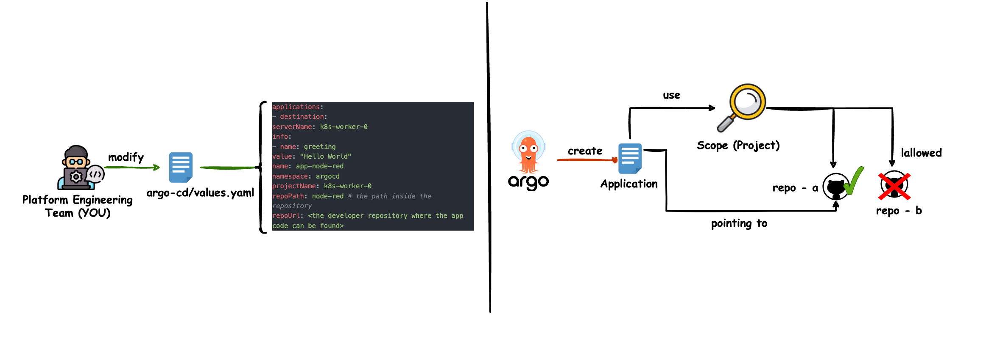

# How to add an application to Argo CD

!!! note
    
    This page describes adding additional apps to your platform.
    Most likely this will be app-of-apps constructs to enable a self-service
    approach for developer teams.
    If you want to add applications to your base-stack use the
    app-sets in conjunction with cluster labels instead.

Make sure you added the needed Project and Repositories. You should also think about setting appropriate RBAC on the
Project.

An Argo CD App is the logical concept to encapsulate manifests needed to deploy an application onto kubernetes.
For more information and possible configuration check:
https://github.com/argoproj/argo-cd/blob/master/docs/operator-manual/application.yaml
https://argo-cd.readthedocs.io/en/stable/operator-manual/cluster-bootstrapping/#app-of-apps-pattern

## **Modify Argo CD overlays**
This is an example on how to add a simple application to a spoke-cluster.
Usually you want to add a repository that serves an app-of-apps pattern.
Add the following to your `argo-cd/values.yaml`.
```yaml
bootstrapValues:
    applications:
        - destination:
            serverName: k8s-spoke-0
          info:
            - name: greeting
              value: "Hello World"
          name: app-node-red
          namespace: argocd
          projectName: k8s-spoke-0
          repoPath: node-red # the path inside the repository
          repoUrl: <the developer repository where the app code can be found>
```

That whats happening behind the scenes:



## **Push your changes to git**
Do not forget to push your changes to the git repository that serves your Argo CD application.
If you let Argo CD manage itself, it will add the configured application to the cluster.

## **Run kubara bootstrap again (if Argo CD is not managing itself )**
If Argo CD is not managing itself (default, see `config.yaml` with `services.argocd.status: disabled`) altering Argo CD values will have no effect until you run the following again:
```bash
kubara bootstrap <hub-cluster-name-from-config-yaml>
```
