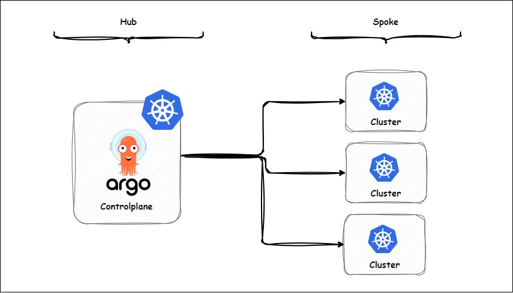
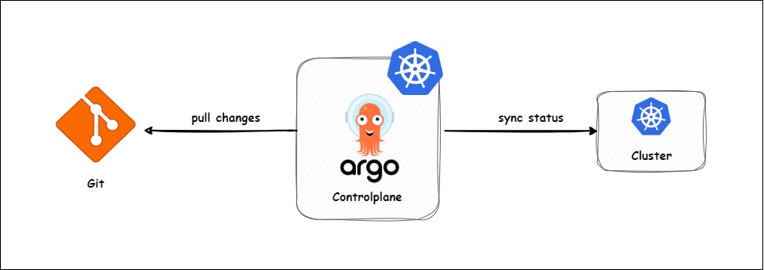

# General Architecture

This document provides an in-depth overview of the architecture of our
Kubernetes (K8s) platform architecture, designed with the best practices
derived from years of experience in building, managing and optimizing
Kubernetes environments at scale. The platform is structured around key
principles such as GitOps, Hub-and-Spoke topology and a focus on scalability,
security and operational efficiency.

Leveraging GitOps as the foundation for continuous deployment and management,
we ensure that infrastructure and application configurations are defined,
versioned and automatically synchronized with the desired state, enabling a
streamlined, reliable and auditable approach to Kubernetes operations. The
``Hub-and-Spoke`` model facilitates the creation of a centralized management hub
while ensuring **secure**, **isolated** and **highly scalable clusters**
(spokes) that can operate independently across various environments and
locations.

Through this architecture, we aim to provide a platform that not only meets the
growing demands of modern, cloud-native applications but also aligns with
industry best practices to maintain high availability, security and
performance. This approach is the result of years of *real-world experience*
with Kubernetes, continuously evolving based on lessons learned,
emerging trends and evolving cloud-native technologies.

## Hub'n'Spoke

The Hub-and-Spoke model in Kubernetes architecture refers to a setup where
multiple Kubernetes clusters (the ``spokes``) are centrally connected to a main
cluster (the ``hub)``. This model offers several advantages, especially in
larger, more complex systems and multi-cluster environments.

1) Centralized Management (Hub)

   - **Unified Control**:
     The central cluster acts as a management center for all
     other clusters. This simplifies administration, particularly for resource
     management, access control and security policies.

   - **Centralized Logs and Monitoring**:
     A central hub allows for unified monitoring, logging and auditing,
     providing administrators with a consolidated view of the entire
     Kubernetes cluster network.

2) Enhanced Security

   - **Isolation**:

     Using separate ``spokes`` for different environments (e.g., dev, test, prod)
     allows an isolation between them, minimizing the risk of a security breach
     in one cluster affecting the infrastructure.

   - **Centralized Policies**:

      Security policies, such as network rules, RBAC and others, can be applied
      consistently across all spoke clusters from the hub, ensuring a unified
      security posture.

3) Scalability

   - **Cluster Automation**:

     The model allows new clusters (spokes) to be create and scaled
     independently without affecting the central hub. New spokes can
     be added quickly and flexibly to meet growing needs.

   - **Resource Distribution**:

     Efficient resource allocation and management across multiple
     clusters and simplifying the scaling.

4) Multi-Region and Multi-Cloud:

   - **Mixed Distribution**:
      Spokes can be deployed in different regions or across different clouds,
      enabling geographic redundancy and resilience. These clusters can still
      communicate with each other, while being centrally managed by the hub.

   - **Disaster Recovery**:
      If one cluster or region fails, the hub-and-spoke model facilitates
      workload migration to other clusters, ensuring high availability and
      disaster recovery.

## GitOps

GitOps is an approach to continuous delivery and infrastructure management,
leveraging Git as the single source of truth for both application code and
infrastructure configurations. In the context of Kubernetes platforms, GitOps
offers numerous advantages, making it a key practice for managing complex,
cloud-native applications.

1) Declarative Management

   - **Single Source of Truth**:

     Configurations (like manifests for deployments, services, etc.) are
     stored in Git repositories. This provides a clear and consistent
     definition of infrastructure and application state, which can be
     version-controlled, auditable and easily retrievable.

   - **Declarative Configuration**:

     GitOps ensures that the desired state of the system is always defined in
     code. This reduces configuration drift and allows Kubernetes to
     automatically reconcile the system with the defined state.

2) Automation and Continuous Deployment

   - **Automated Deployment**:

     GitOps automates the deployment process. Changes to the Git repository
     (such as code updates or configuration changes) trigger automated
     processes (argoCD) that sync the repository with the Kubernetes cluster.
     This reduces manual intervention and speeds up release cycles.

   - **Faster and Reliable Releases**:

     With every change pushed to Git, the deployment process becomes faster
     and more consistent. This leads to frequent, smaller and more reliable
     releases, improving overall agility.

3) Security and Auditability:

   - **Audit Trail**:

     GitOps creates a full audit trail in Git, where every change is tracked
     with detailed commit histories. This makes it easier to identify who made
     a change, what change was made and why it was made, providing greater
     transparency and accountability.

   - **Access Control**:

     By integrating with Git repositories, GitOps can utilize existing
     git-based access controls. This ensures that only authorized
     individuals can make changes to the infrastructure or applications,
     enhancing security.

4) Consistency:

   - **Environment Replication**:

     GitOps ensures that the same configurations and workflows are applied
     across all environments, including development, staging and production.
     This reduces the risk of discrepancies between environments, leading to
     fewer "it works on my machine" issues and making it easier to achieve
     consistency across clusters.

5) Scalability and Flexibility:

   - **Efficient Scaling**:

     GitOps facilitates the scaling of Kubernetes platforms by allowing teams
     to manage multiple clusters using the same workflows. Changes can be
     propagated to any number of clusters automatically, making it easier to
     scale applications and services across different regions or environments.

   - **Decoupling of Deployments**:

     GitOps enables teams to separate the concerns of code and infrastructure,
     leading to more flexibility in scaling both the application code and the
     infrastructure independently.
