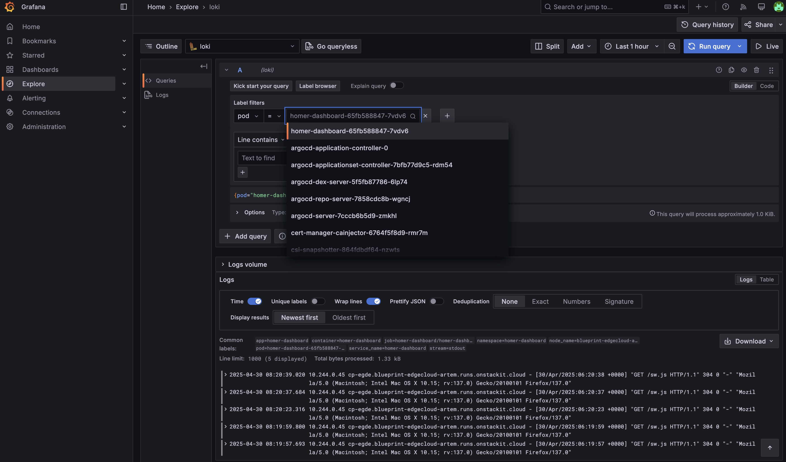

# Logs

Centralized log processing in our Kubernetes observability stack is handled by **Loki** and **Alloy**, with **Grafana** as the frontend for analysis. This stack provides a lightweight and scalable logging solution tailored for Kubernetes - similar to what Prometheus offers for metrics.

## Component Overview

- **Loki** is a log aggregation system that indexes logs by labels (e.g., pod, namespace, container). Unlike traditional logging systems (e.g., Elasticsearch), Loki does not index log content, which results in lower resource usage.
- **Alloy** runs as a DaemonSet on each node and collects logs directly from container log files. These logs are then pushed to Loki.
- **Grafana** acts as the user interface for exploring and analyzing logs with filters, queries, and correlations to metrics.

## Access & Integration

Logs can be accessed directly in Grafana under **Explore > Loki**. This interface allows you to search, filter, and group logs by labels, and even combine them with Prometheus metrics.



You can find more about Grafana in the [Dashboards](../6_components/observability_dashboards.md) chapter.

## kubara Standardization

In kubara, **Alloy is enabled by default**. It is configured to automatically collect logs and enrich them with Kubernetes metadata such as namespace, pod name, container, and user-defined labels.

This ensures that logs from all applications are captured consistently and are immediately available for centralized analysis without per-project setup.

## Label-Based Logging

A core concept of Loki is **label-based filtering and grouping**. Typical labels applied automatically include:

- `namespace`
- `pod`
- `container`
- `app` (from pod labels)
- `loglevel` (optionally extracted from log content)

This enables precise queries like:

```
{namespace="my-app", loglevel="error"} |= "failed"
```

## Why JSON logging

JSON gives log consumers a standard way to extract fields such as severity, HTTP status, duration and request ID, when the application emits them. Queries and alerts can use those fields even when the human-readable message changes. Native JSON encoders escape quotes and newlines correctly; a stack trace included in a single event can remain in one record instead of requiring multiline reconstruction.

JSON does not create missing fields or a common schema. A record containing only a message provides fewer benefits, and logfmt is also a structured format. JSON can increase log volume and is less convenient to read directly in a terminal; use a formatted viewer for manual inspection.

## Catalog logging defaults

The defaults described below are introduced by [catalogs PR #209](https://github.com/kubara-io/catalogs/pull/209). They apply after that change is merged, included in a catalog release, and adopted by your platform. Earlier catalog versions may still emit text or logfmt.

With these defaults, catalog-managed services use their native JSON logging options wherever the upstream application and chart support them. Each event should be a single JSON object on one line. Field names remain application-specific; these defaults do not impose a shared event schema or introduce new indexed Loki labels.

Log levels and access-log enablement remain unchanged. Changing the format does not enable request logging for a service where it was disabled. User-supplied values can override the catalog defaults.

### Coverage

| Catalog component | Configuration / coverage |
| --- | --- |
| Argo CD | `argo-cd.global.logging.format: json`, inherited by the Argo CD components and Dex. Redis and shell helpers are exceptions below. |
| cert-manager | `--logging-format=json` for controller, webhook, cainjector and startup API check; preserve the startup check's verbose flag. |
| External DNS | `external-dns.logFormat: json`. |
| External Secrets | Native production JSON logger; no format override needed. |
| Crossplane | Native production JSON logger; debug mode can change the format. Provider packages have their own logging configuration. |
| MetalLB | Controller and speaker use native JSON logging. FRR and helper processes are separate. |
| Kyverno | `kyverno.features.logging.format: json` for the controllers. |
| Policy Reporter | JSON encoding for the reporter, UI, Kyverno plugin and optional Trivy plugin. Does not enable optional components. |
| Metrics Server | `--logging-format=json`; preserve the existing kubelet flag. |
| Reloader | `reloader.reloader.logFormat: json`. Both levels are required: the outer key selects the dependency, the inner key configures its application. |
| Traefik | General and access log format set to JSON; general log colors disabled. Access logging is not enabled by this setting. |
| Velero | `velero.configuration.logFormat: json`. Plugin subprocesses may have their own output. |
| Prometheus stack | JSON for Prometheus Operator, Prometheus, Alertmanager, optional Thanos Ruler, Grafana console, node exporter and blackbox exporter, including the optional blackbox config reloader. Grafana's k8s-sidecar already defaults to JSON. |
| Loki | `loki.loki.server.log_format: json` for server logs and `log.format: json` for memcached exporters. Optional NGINX gateway access logs use JSON escaping. |
| Alloy | `logging { format = "json" }` in the Alloy configuration. This controls Alloy's own diagnostics, not collected workload log content. |
| Longhorn | Manager, global manager and driver deployer use native JSON logging. Other Longhorn processes are exceptions below. |
| Homer | lighttpd access logs use a JSON format with `accesslog.escaping = "json"` (requires lighttpd 1.4.66 or newer). Error and startup output remain native. |
| OpenBao (Terraform-managed) | Server and optional injector use the chart's `logFormat: json`. |
| Bootstrap CRDs, Kyverno policies, template library | No application log producer of their own. |

### Remaining non-JSON output

This is a JSON-by-default baseline, not a guarantee that every byte written by every container is JSON. The following require an upstream feature, a separate implementation or a collector-side policy:

- **OAuth2 Proxy:** exposes text templates for standard, authentication and request logs, but no native JSON encoder. Do not approximate JSON by quoting unescaped template variables or Go `printf "%q"`: Go string escaping can emit escapes that JSON does not accept. Template workarounds exist, but need separate validation and do not control every subprocess. Native structured logging is tracked in [issue #1057](https://github.com/oauth2-proxy/oauth2-proxy/issues/1057) and [PR #3339](https://github.com/oauth2-proxy/oauth2-proxy/pull/3339); check their release status before relying on new options.
- **kube-state-metrics:** uses klog flags and does not expose `--log-format=json`. Do not add an unsupported flag, which would prevent startup.
- **Redis, memcached, FRR, NGINX/lighttpd error logs:** retain their native output; an access-log format does not change error logs.
- **Loki Canary:** generated test lines and diagnostics are not ordinary application events. Preserve its payload and validation behavior.
- **Alloy config reloader:** the chart exposes replacement arguments, not an additive log-format setting. Preserve the generated reload URL and port rather than hardcoding them just to add a logging flag.
- **Longhorn engine, instance manager, CSI sidecars, UI and wait/init containers; Argo CD Dex restart/Redis initialization jobs; other shell hooks and plugin subprocesses:** the main application's logging setting does not control all subprocess output.

Collection must continue accepting these formats. Do not discard non-JSON lines or blindly parse every workload with a JSON-only pipeline. Existing format-dependent queries and alerts need review when these defaults are rolled out. JSON fields such as request IDs should not automatically become indexed Loki labels.

### Validation

Build chart dependencies, then run `helm lint` and `helm template` with the chart's CI values where provided. Check rendered container arguments and embedded ConfigMaps/Secrets, not only the umbrella values: Helm silently accepts unused values.

The catalog repository's checks also generate all services for each provider and validate the generated Helm and Terraform output. Before rollout, sample stdout/stderr from the deployed components, parse complete lines as JSON, and exercise an error path to check exception escaping. Helm rendering cannot establish runtime JSON validity for every application.

### Upstream references

- [Argo CD chart logging options](https://github.com/argoproj/argo-helm/blob/main/charts/argo-cd/values.yaml)
- [cert-manager logging flags and JSON registration](https://github.com/cert-manager/cert-manager/blob/master/pkg/logs/logs.go)
- [OAuth2 Proxy logger templates](https://github.com/oauth2-proxy/oauth2-proxy/blob/master/pkg/logger/logger.go)
- [kube-state-metrics logging flags](https://github.com/kubernetes/kube-state-metrics/blob/main/pkg/options/options.go)
- [Alloy logging configuration](https://grafana.com/docs/alloy/latest/reference/config-blocks/logging/)
- [lighttpd access log JSON escaping](https://redmine.lighttpd.net/projects/lighttpd/wiki/Mod_accesslog)
- [OpenBao chart values](https://github.com/openbao/openbao-helm/blob/main/charts/openbao/values.yaml)

## Best Practices

- Use structured logging (e.g., JSON) whenever possible for better field extraction.
- Maintain consistent labels - especially `app`, `loglevel`, `team`, etc.
- Leverage Grafana's "Live Tail" feature for real-time log monitoring.
- Combine logs with metrics for faster root cause analysis (e.g., using "Split View").