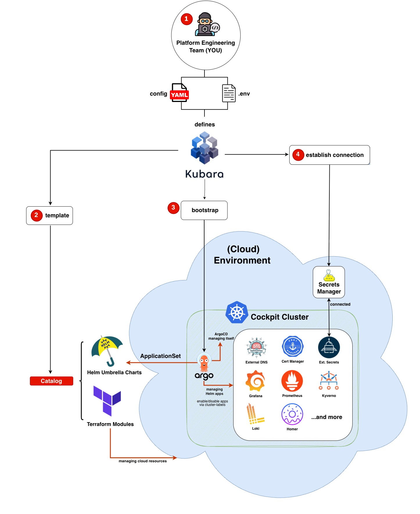

# Kubara

## 🤔 What is Kubara?

**Kubara** is a single binary CLI tool written in Go providing a lightweight framework for bootstrapping 
Kubernetes platforms with production-proven best practices very easily.  

This includes infrastructure provisioning, multi-tenancy setup, GitOps onboarding, and essential third-party 
tooling - all in a single reusable [GitOps](4_architecture/architecture_overview.md#gitops) workflow.  

  

Kubara gives you a unified, reproducible way to deploy Kubernetes platforms with minimal effort and maximum 
consistency whether you're running on Cloud, Edge or Hybrid Setup.

Kubara provides you with a reusable, extensible structure to build and operate your Kubernetes platform - including Terraform modules, Helm charts, and secrets management - while keeping configuration simple and declarative.  

## ⭐ Main Features

- ⚙️ **Full Platform Bootstrap** - From infrastructure to observability, GitOps, and secrets
- 🧱 **Modular by Design** - Helm and Terraform based components, easily extendable
- 🔁 **Multi-cluster Support** - ControlPlane + N worker clusters, with app targeting
- 🚀 **Fast Setup** - Ready to go in under 30 minutes
- ☁️ **Cloud & Edge Ready** - Use it across cloud, hybrid, or bare-metal environments
- 🔐 **Built-in Best Practices** - Production-grade setup used by real-world platforms

## 🙋 Why use Kubara?

Setting up a secure, multi-cluster Kubernetes platform is hard.

Kubara simplifies this with a single Go binary that:

- Generates required configuration and secrets
- Templatizes and deploys pre-vetted infrastructure components
- Bootstraps your platform using Argo CD and GitOps
- Allows easy onboarding of new clusters and workloads

All based on real-world usage at Schwarz Group and the experience of multiple engineering teams - so you don't have to reinvent the wheel.

## 🛠️ How does it work?

Kubara takes care of:

1. 📄 Initial configuration via `.env` and `config.yaml`
2. 🧩 Rendering and deploying Terraform and Helm modules
3. 🧪 Validating schemas and environment settings
4. 🚀 Bootstrapping the ControlPlane and Argo CD
5. 📦 Managing secrets (incl. External Secrets Operator)
6. 🧱 Adding additional worker clusters and workloads

## 🚀 Getting Started

Follow the [Bootstrap Your Platform Guide](1_getting_started/bootstrap_process.md) to:  

- Install the CLI
- Prepare your `.env` and `config.yaml`
- Run `kubara init`, `kubara schema` (optional) and `kubara generate`
- Bootstrap Argo CD with `kubara bootstrap <cluster-name>`

You're done 🎉

## 🛣️ Roadmap

We're continuously improving Kubara. Upcoming features:

- Extend Pipelines
- Add flavors: security, high availability, etc.
- Support more cloud providers

## 🎥/📝/🎙️ Multimedia

- [🎙️ Kubernetes Platform Blueprint | Co-Located Workshop with vCluster at KubeCon, 2026](https://www.vcluster.com/events/kubernetes-platform-blueprint)
- [🎥 Free Course based on kubara, 2026 | Course at Platform Engineering University](https://university.platformengineering.org/introduction-to-gitops-for-platform-engineering)
- [🎙️ How to build a Multi-Tenancy Internal Developer Platform with GitOps and vCluster | Talk at ContainerDays Hamburg, 2025](https://www.youtube.com/watch?v=yQsnA91Gtcs)
- [🎥 How to build a multi-tenancy Internal Developer Platform with GitOps and vCluster | PlatformCon 2025 | Virtual Workshop ](https://www.youtube.com/watch?v=2wQ4w1NKfd4)
- [🎥 Load Testing Argo CD at Scale with vCluster and GitOps | vCluster Labs | Webinar ](https://www.youtube.com/watch?v=0XEWn4VmiDE)
- [🎙️The GitOps Blueprint: Multi-Tenant Kubernetes with Argo CD in 30 Minutes | Cloud X Summit 2025 | Talk](assets/The_GitOps_Blueprint_Multi-Tenant_Kubernetes_with_Argo_CD_in_30_Minutes.pdf)
- [📝 How We Load Test Argo CD at Scale: 1,000 vClusters with GitOps on Kubernetes | Medium and ITNEXT | Blog](https://medium.com/itnext/how-we-load-test-argo-cd-at-scale-1-000-vclusters-with-gitops-on-kubernetes-d8ea2a8935b6)
- [📝 How to Build a Multi-Tenant Kubernetes Platform with GitOps and vCluster | Medium and ITNEXT | Blog](https://medium.com/itnext/from-ci-to-kubernetes-catalog-building-a-composable-platform-with-gitops-and-vcluster-7e1decaa81da)

## 🤝 Contributing

We 💙 contributions! Here's how to get started:

1. Check the [Issues](https://github.com/kubara-io/kubara/issues)
2. Open a new one if your problem isn't listed
3. Want to fix something yourself? Go ahead and open a PR!
4. Follow our [Commit Message Conventions](5_community/contributing.md)

We're happy to help and review 🙌

## 🏷️ Versioning

Kubara follows [Semantic Versioning](http://semver.org/) in the `style v0.1.0-something`.
Releases are listed in the [Release section](https://github.com/kubara-io/kubara/releases).

## 📝 License

This project is licensed under the [Apache 2.0 License](6_reference/licence.md).
Use it freely. No warranties. Contributions welcome.
